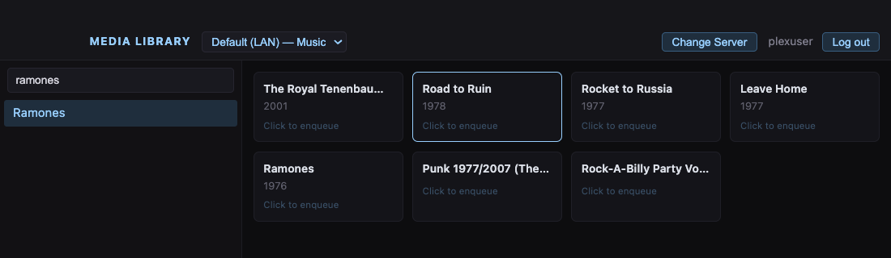
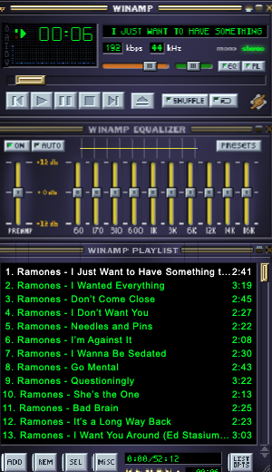
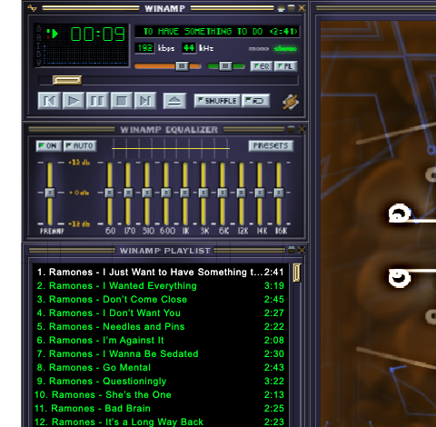

# Plexamp Classic

Old-school Winamp 2.9-style player for macOS and Linux, wired to Plex — including owned and shared servers.



The library browser is the bridge: search Plex artists, choose an album, and send it to the Winamp-style player.

## What it does

Plexamp Classic packages [Webamp](https://github.com/captbaritone/webamp), a pixel-faithful Winamp 2.9 reimplementation, in an Electron app and connects it to Plex Media Server.

- **Native Panel Windows** — the main player, playlist, equalizer, and visualizer are independent frameless OS windows with no transparent click-eating surface between them.
- **Windowed Player mode** — a conventional single application window remains available as a fallback.
- **Plex library browser** — search artists, browse albums, and send a complete album to the Winamp playlist.
- **Plex account login and federation** — PIN-based login discovers owned and shared servers, then probes LAN, public, and relay connections.
- **MilkDrop visualization** — Butterchurn's WebGL visualizer and bundled preset collection.
- **Fractional scaling** — 75%, 100%, 115%, 125%, 150%, 175%, and 200%; also available with `⌘=`, `⌘-`, and `⌘0`.
- Media keys, classic windowshade behavior, and `.wsz` skin drag-and-drop.

### Winamp player



### MilkDrop



## Requirements

- macOS (universal) or Linux x86_64
- Node.js 22 or newer
- A Plex account or a direct Plex Media Server URL and token

## Run from source

```bash
git clone https://github.com/imzenreally/plexamp-classic.git
cd plexamp-classic
npm install
npm start
```

`npm install` copies the required Webamp runtime bundles from the pinned npm package into `vendor/`. Those generated files are intentionally not committed.

The simplest setup is **Log in with Plex** inside the app. For a direct LAN server, optionally copy `.env.example` to `.env` and set:

```dotenv
PLEX_HOST=http://your-plex-server:32400
PLEX_TOKEN=your-plex-token-here
PLEX_SECTION=
```

`PLEX_SECTION` is optional; when omitted, the first music section is selected. `.env` is gitignored and is used only when running from source. It is **not packaged into application builds**.

See Plex's documentation for [finding an authentication token](https://support.plex.tv/articles/204059436-finding-an-authentication-token-x-plex-token/).

## Build the macOS app

```bash
npm run dist
```

The unsigned build is written under `dist/`. Because it is not notarized, macOS may require the usual right-click → Open approval on first launch.

## Build the Linux AppImage

```bash
npx electron-builder --linux AppImage
```

The build must run on Linux x86_64 (electron-builder's AppImage tooling is Linux-only). Build inside an older-stable container such as `node:22-bullseye` so the resulting AppImage's glibc requirement stays low and it runs on a wide range of distros.

The AppImage's desktop entry launches with `--no-sandbox` — the standard electron-builder default for AppImages, because Chromium's sandbox cannot be setuid through FUSE. The artifact is written under `dist/`.

## Architecture

```text
main.js                  native panel windows, validated IPC, app:// and
                         app-stream:// protocols, Plex proxy, menus, modes
 auth.js                 Plex PIN login, resource discovery, connection probes,
                         TLS-tolerant request and stream helpers
preload.js               narrow contextBridge API for all renderers
player.js / player.html  Webamp/audio leader, fractional zoom, media keys
*-window.js / .html      native playlist, equalizer, and visualizer satellites
library.js / library.html
                         server picker and artist/album browser
butterchurn-loader.mjs   Webamp Butterchurn module loader
scripts/prepare-vendor.js
                         copies pinned Webamp bundles after npm install
```

The `app-stream://` proxy exists because many Plex servers advertise HTTPS endpoints with self-signed certificates. The main process fetches audio, preserves Range requests for seeking, and exposes only opaque temporary stream URLs to the renderer.

## Security and privacy

- Plex tokens and account state are never committed.
- `.env` is excluded from Git and from packaged builds.
- Plex account auth is stored in Electron's per-user application-data directory.
- This repository contains no preconfigured server addresses, account names, or Plex credentials.

## License and credits

Project-specific code is available under the [MIT License](LICENSE). See [THIRD_PARTY_NOTICES.md](THIRD_PARTY_NOTICES.md) for Webamp and Butterchurn license notices.

Winamp and Plex are trademarks of their respective owners. This is an unofficial project and is not affiliated with or endorsed by either company.
